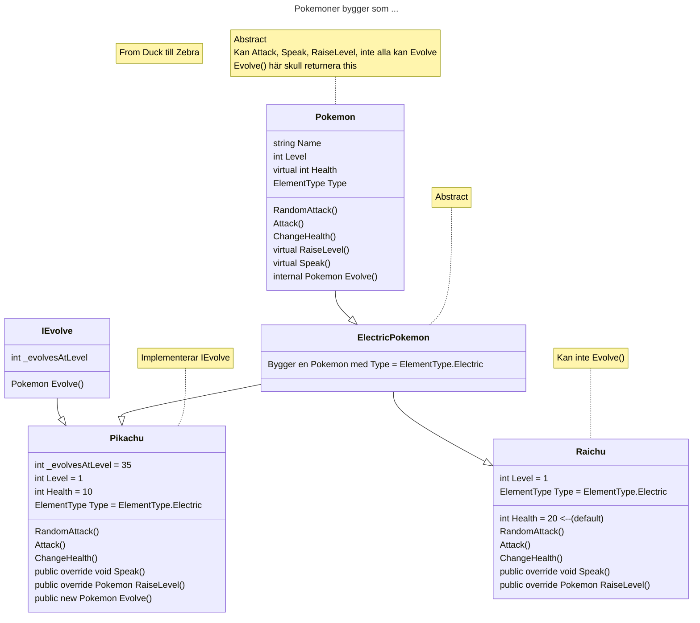

# Pokemon Simulator

## En exploration av C# OOP Koncepter

Jag använder `inheritance`, `interface`, `abstract` och `sealed` klasserna.

Koden vissas att barn klasserna skulle kunna hantera som bas:





Och vi kan hanteras all Pokemon, de som implementerar IEvolve och de som gör det inte, som Pokemon bas klass:

```C#
List<Pokemon> Belt = new() 
{
        new Pikachu(34), 
        new Squirtle(9), 
        new Bulbasaur(14),
        new Charmander(19),
        new Raichu(60)
};
```

> [!IMPORTANT]  
> Man ska vanligt bygga pokemon med:
> ```c# Pokemon myPokemon = Pikachu(12); ```
> Pokemon som byggs skulle ha bara attacker som passeras vid sin egen subtypes.
>
> Man kan också bygga pokemon med egen attacks som:
> ```c# Pokemon myPokemon = Pikachu(12, attacks); ```
> `attacks` måste vara `List<Attack>`
> Om man passerar attacks till konstrktor då, det finns inget check att attacks passerar till pokemon som byggs!


